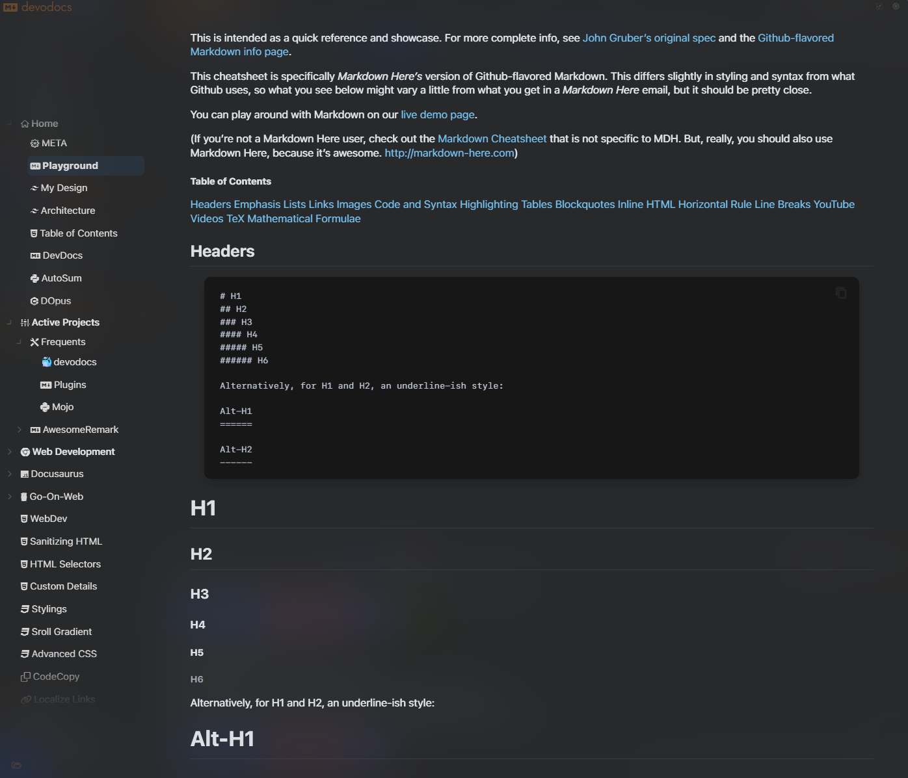

# `devo`

> fast, yet **heavily extensed**,  Markdown previewer powered by  Wails (v2).

---

## TOC

The ==table of contents== is organized based on a file named `SUMMARY.md`.

::: hint
*As the name suggests*, the formatting of this file follows the same general layout as `mdbook` summaries.
:::

==Work in Progress== → *Maybe also forever...*

**Feel free to <u>not</u> to stick around!**
